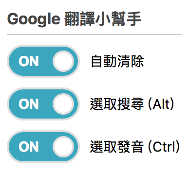

# Google 翻譯小幫手
> Chrome 擴充套件。



## 功能簡介
* 自動清除 - 從其他應用返回 Google 翻譯頁面時，自動清除上次輸入內容。
* 選取搜尋 - 在網頁反白欲搜尋之文字，按快捷鍵 `alt` 滑出翻譯資訊卡，快捷鍵 `esc` 隱藏資訊卡。目前只支援英翻中。


## 套用方式
> 此擴充套件並未發布至 Google 線上應用程式商店，因此需自行設置載入至 chrome。

1. 下載此擴充套件(下方兩種方式則其一)：  
  a. 點選此頁面之 `Clone or download` 按鍵下載後解壓縮
    
  b. 使用 `git` 指令
  ```bash
  git clone https://github.com/JayZang/google-translate-helper/
  ```  
2. 在 chrome 瀏覽器鍵入 `chrome://extensions/`
3. 瀏覽器頁面右上方開啟`開發人員模式`後，點選`載入未封裝項目`並選擇 1.a 步驟解壓縮後之資料夾
  
4. 安裝成功！可於 chrome 網址列右側找到功能圖示。
